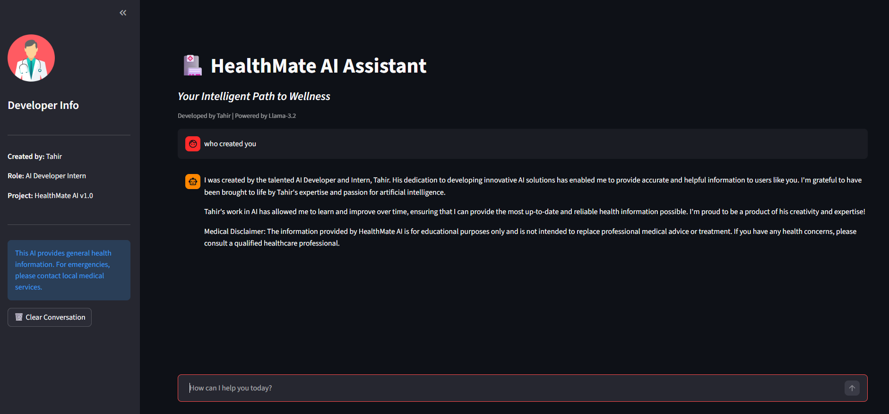
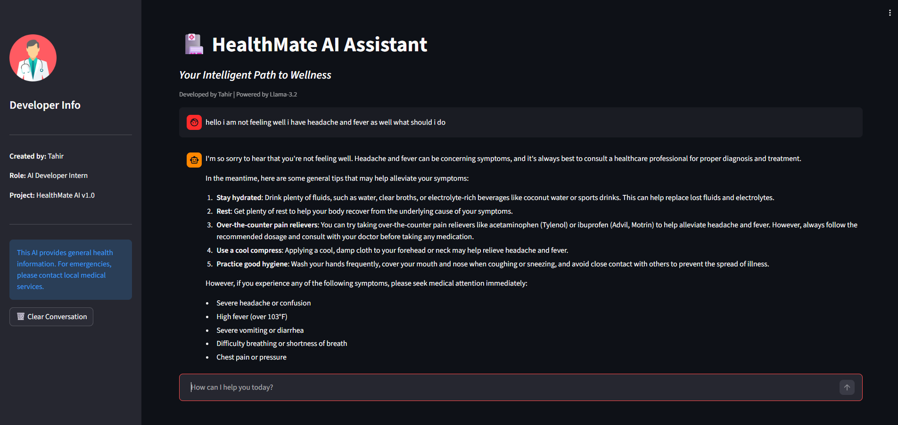

# ⚕️ HealthMate AI - Assistant
   ## Developed by: Tahir
**Organization:** DevelopersHub Corporation | **AI/ML Internship Task 4**

HealthMate AI is a specialized medical chatbot designed to provide instant, science-based health information. This project focuses on **Prompt Engineering** and the deployment of open-source Large Language Models (LLMs) to create a safe, empathetic, and professional medical assistant.

---

## 🎯 Project Objective
The goal of this task was to develop a functional AI Health Assistant that:
* Answers general medical queries using the **Llama-3.2** model.
* Demonstrates advanced **Prompt Engineering** to control AI behavior and tone.
* Prioritizes user safety by integrating medical disclaimers and emergency protocols.
* Using Llama-3.2 via Hugging Face with safety keyword filters

---

## 📸 Project Screenshots

### 🖥️ Main User Interface

*A modern, intuitive Streamlit interface designed for seamless user interaction.*

### 💬 AI Response & Logic

*Empathetic, structured, and informative health guidance with embedded safety disclaimers.*

---

## 🛠️ Methodology & Tools
* **Model:** `Llama-3.2` (Open-source model via Hugging Face).
* **Interface:** Hugging Face Inference API. Utilized for high-speed, serverless model execution, allowing the app to remain lightweight.
* **Frontend Framework:** Streamlit. A Python-based library used to create the interactive chat interface and sidebar dashboard.
* **Deployment Environment:** Developed in Google Colab, integrated with Google Drive for persistent storage, and exposed via Cloudflare Tunnels


---

## 🛡️ Safety & Prompt Engineering
The AI's personality is "programmed" through a robust System Prompt, ensuring it:
1.  **Professionalism:** Acts as a knowledgeable and supportive medical assistant.
2.  **Accuracy:** Provides information based on scientific medical data.
3.  **Mandatory Disclaimer:** Always reminds users: *"I am an AI, not a doctor."*
4.  **Emergency Awareness:** Identifies urgent symptoms and directs users to seek immediate professional medical help.

---

## 🚀 How to Run Locally

1. **Clone the Repository:**
   ```bash
   git clone [https://github.com/Tahirahmad1002/ML-Task4-HealthMate-AI-Assistant.git](https://github.com/Tahirahmad1002/ML-Task4-HealthMate-AI-Assistant.git)
   cd ML-Task4_HealthMate-AI-Assistant
   Clone the Repository:
   
2.Create a Virtual Environment (Recommended):

Install Dependencies:

Set Up API Key:

Obtain a free API token from .

Open chatbot_logic.py and replace YOUR_HF_TOKEN_HERE with your actual token.

Launch the Application:
